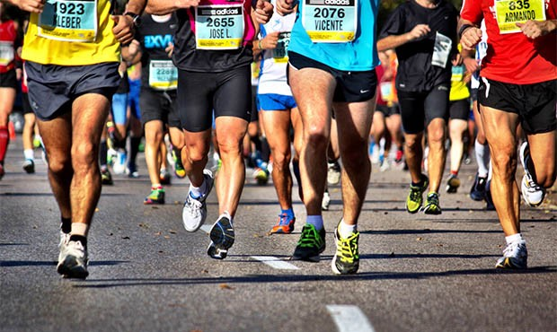

How to win a marathon: Linear model with R
================



[Photo credit](https://miro.medium.com/max/620/0*F_jy9bXTi5q80nDe.jpg)

I love Marathons, they are good ways to raise money for good causes and
to get healthier while enjoying making more friends. Sadly, due to
Covid19 many marathons have been suspended or canceled. As a way to
remember this great activity, I am going to use a marathon data trying
to answer the following question, how the training miles affect the
speed of the runners in the marathon. Since the speed is not readily
available in the data set, I will calculate form the distance and time
column.

``` r
# let's first take a look a the original data 
marathon <- read_csv("marathon.csv", col_types = cols(
  id = col_factor(),
  female = col_factor(),
  footwear = col_factor(),
  group = col_factor(),
  injury = col_factor()
))
marathon
```

    ## # A tibble: 2,303 x 11
    ##    id      age   bmi completed_marat… female footwear group injury distance
    ##    <fct> <dbl> <dbl>            <dbl> <fct>  <fct>    <fct> <fct>     <dbl>
    ##  1 1        25  21.6                0 1      2        2     1            NA
    ##  2 2        41  23.9                0 0      2        2     1            NA
    ##  3 3        25  21.6                0 0      2        2     1            NA
    ##  4 4        35  23.6                1 0      2        1     2         42195
    ##  5 5        34  22.7                0 0      2        1     1            NA
    ##  6 6        45  42.1                0 1      2        2     2            NA
    ##  7 7        33  22.5                1 0      2        2     2         42195
    ##  8 8        58  25.2                0 0      1        2     3            NA
    ##  9 9        29  24.5                0 0      1        3     2            NA
    ## 10 10       36  25.4                0 1      2        1     1            NA
    ## # … with 2,293 more rows, and 2 more variables: time <dbl>,
    ## #   training_miles <dbl>

> Well, there are many columns in the data set. But we are only
> interested in learning how training miles before the marathon affects
> the speed of the runners so let’s us do some wrangling

``` r
# we will filter only those who completed the marathon and then calculate the speed
marathon_speed <- marathon %>% filter(completed_marathon == 1) %>%
  mutate(speed = distance / time,
         id = factor(id),) %>%
  select(-c(completed_marathon,
            distance,age,bmi,
            time,female,footwear,group))
marathon_speed
```

    ## # A tibble: 929 x 4
    ##    id    injury training_miles speed
    ##    <fct> <fct>           <dbl> <dbl>
    ##  1 4     2                  60  4.10
    ##  2 7     2                  50  3.43
    ##  3 12    1                  65  3.84
    ##  4 13    1                  88  3.95
    ##  5 14    1                  51  3.14
    ##  6 17    1                  40  2.82
    ##  7 20    1                  75  3.93
    ##  8 22    1                  45  3.88
    ##  9 25    1                  39  2.54
    ## 10 26    1                  45  2.73
    ## # … with 919 more rows

``` r
# now let's visualize the relationship between speed and training miles and injury
plot_speed <- marathon_speed %>% ggplot(aes(training_miles, speed, color = injury))+
    geom_jitter() + 
    xlab('training_miles') + 
    ylab("speed") + 
    theme_bw()+
   ggtitle("Variation of speed by training miles and injury")
plot_speed
```

<!-- -->

> Injury does not seem to be affecting the speed so we will not include
> it in our model.

``` r
# Finally, we will build the mode
tidy(lm(speed~training_miles,marathon_speed))
```

    ## # A tibble: 2 x 5
    ##   term           estimate std.error statistic   p.value
    ##   <chr>             <dbl>     <dbl>     <dbl>     <dbl>
    ## 1 (Intercept)      2.19    0.0439        49.8 5.43e-264
    ## 2 training_miles   0.0202  0.000779      25.9 1.07e-111

Since the p-value under the null hypothesis is 1.074358e-111 , we know
that there is a significant association between `training_miles` and the
running speed `speed` in the competitions at a significance level of
0.05. So if you want to win the next marathon, you know what you should
be doing :)
